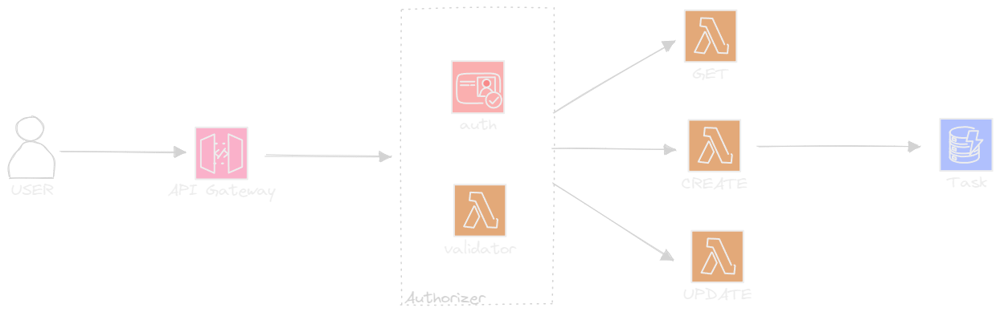

# ServerlessAWS

| Services aws -----------> | _API_                                  |
| ------------------------- | -------------------------------------- |
| Api Gateway               | https://aws.amazon.com/es/api-gateway/ |
| Lambda                    | https://aws.amazon.com/es/lambda/      |
| DynamoDB                  | https://aws.amazon.com/es/dynamodb/    |
| Cognito                   | https://aws.amazon.com/es/cognito/     |
| NodeJS                    | https://nodejs.org/es                  |

---

1. npm install -g serverless
2. serverless create --template aws-nodejs --path my-sls-project
3. npm install -g serverless
4. serverless config credentials
5.
